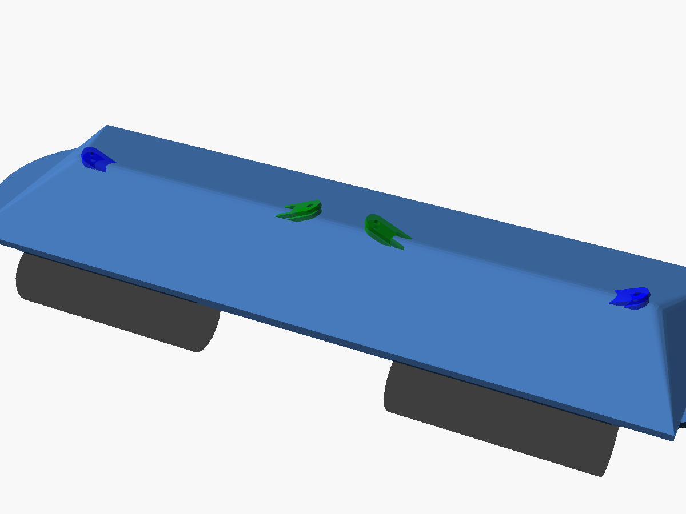
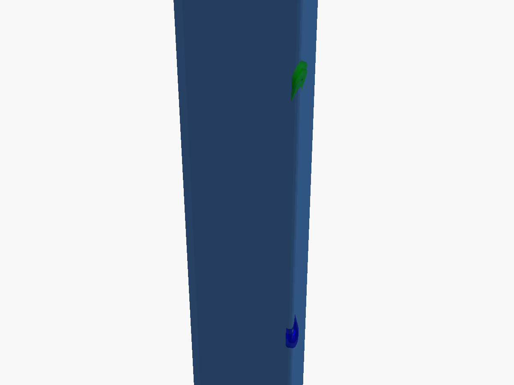
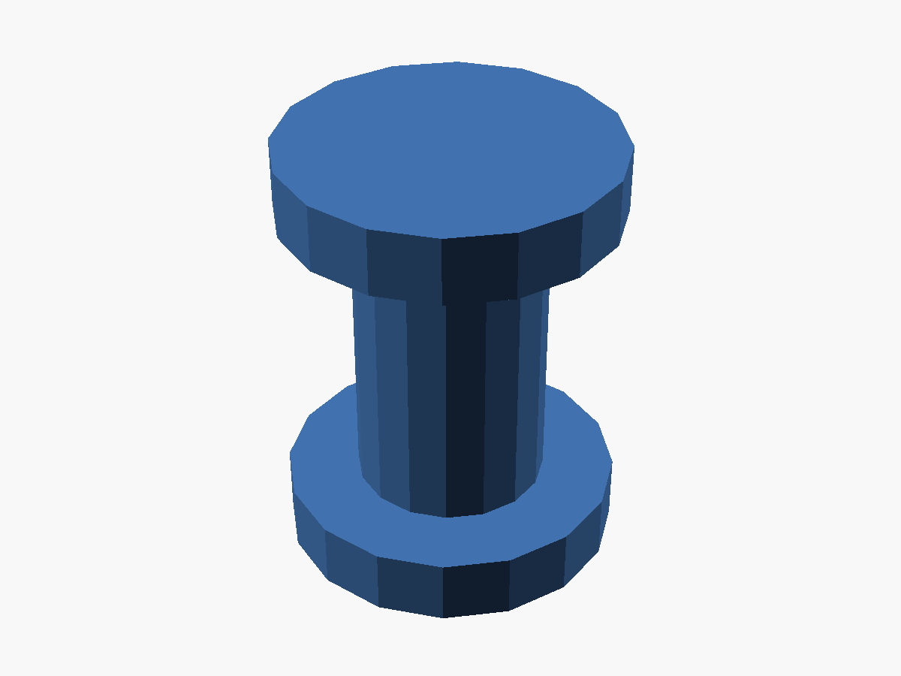
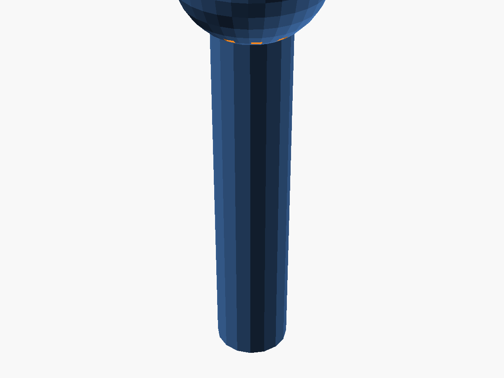

# Scissor-Skate: Collapsible Skateboard

A portable, collapsible skateboard that uses a scissor-lift (pantograph) mechanism for the deck itself — **you stand directly on the scissor mechanism while skating**. No separate top or bottom deck platforms. The wide, sturdy scissor arms with integrated foot platforms ARE the riding surface.

## 🖼️ Renders

### Extended (Rideable) — Stand on the Scissor Mechanism



### Collapsed (Portable)



### Individual Components

| Scissor Arms | Foot Platform | Truck Bracket |
|--------------|---------------|---------------|
|  |  |  |

| Pivot Pin | Lock Mechanism |
|-----------|----------------|
|  |  |

### Additional Views (Planned)

The following renders would further illustrate the design — contributions welcome!

- **Exploded view**: All parts separated vertically showing assembly order (use `render_mode = "exploded"` in OpenSCAD)
- **Collapsed vs. extended side-by-side**: Direct comparison of both states
- **Pivot close-up**: Shoulder bolt hole detail with chamfer cross-section
- **Collapse motion animation** (GIF): Animated sequence from extended → collapsed

## 📐 Design Specifications

### Collapsed Dimensions
- **Length**: ~11-15 inches (279-381mm)
- **Width**: ~8-9 inches (203-229mm)
- **Thickness**: 2-4 inches (51-102mm)
- **Profile**: Slim elongated pack, fits lengthwise in backpack

### Extended Dimensions
- **Length**: ~20-28 inches (508-711mm) - full rideable skateboard
- **Width**: ~8-10 inches (203-254mm)
- **Profile**: Rideable scissor mechanism with foot platforms

## 🎯 Features

- **Stand on the Scissor Mechanism**: No separate deck — ride directly on the collapsing scissor arms
- **Foot Platforms with Grip**: Textured pads on top of scissor arms for secure footing
- **Parametric OpenSCAD Design**: Fully customizable through variables
- **Scissor-Lift Mechanism**: Pantograph design for smooth folding/unfolding
- **3D Printable**: Designed for PLA, PETG, or tougher filaments
- **Modular Assembly**: Separate printable components with pivot pin connections
- **Truck Mount Brackets**: Standard skateboard truck mounting at scissor endpoints
- **Manual Locking System**: Pin mechanism for secure riding position
- **Lightweight Structure**: Efficient arm geometry, no unnecessary material

## 🛠️ Building Your Scissor-Skate

### Prerequisites

- **OpenSCAD** (latest version recommended): https://openscad.org/downloads.html
- **3D Printer** with build volume at least 250mm x 250mm
- **3D Printing Filament**: 
  - PLA (easiest to print, rigid)
  - PETG (more durable, slight flex)
  - Nylon or TPU blends (for high-strength applications)

### Step 1: Customize the Design

Open `scissor_skate.scad` in OpenSCAD and adjust the parameters. Parameters are defined in `components/parameters.scad`:

```openscad
// Overall board dimensions (when extended)
deck_length_extended = 24 * 25.4;  // 24 inches in mm
deck_width = 9 * 25.4;              // 9 inches in mm

// Collapsed dimensions  
collapsed_length = 13 * 25.4;       // ~13 inches when folded

// Scissor mechanism (arms ARE the deck)
num_scissor_pairs = 3;              // Number of side-by-side arm pairs
arm_width = 60;                     // mm (wide — you stand on these)
arm_thickness = 8;                  // mm (thick for rider weight)

// Foot platform (pads on top of scissor arms)
foot_platform_length = 100;         // mm
foot_platform_width = 200;          // mm

// Truck mounting (at scissor endpoints)
truck_mounting_hole_diameter = 5;   // mm
truck_mounting_pattern_width = 2.125 * 25.4;  // Standard pattern
```

### Project Structure

The design is split into modular component files for maintainability:

```
scissor-skate/
├── scissor_skate.scad              # Main entry point (assembly + render modes)
├── components/
│   ├── parameters.scad             # All configurable parameters
│   ├── scissor_mechanism.scad      # Scissor arms, foot platforms, truck brackets
│   ├── truck_mounting.scad         # Truck mounting hole pattern
│   ├── deck_surface.scad           # Deck surface shape (utility module)
│   ├── pivot_pin.scad              # Pivot pin + shoulder bolt hole modules
│   └── lock_mechanism.scad         # Locking pin
├── archive/
│   ├── deck_top.scad               # (Legacy) Top deck platform
│   └── deck_bottom.scad            # (Legacy) Bottom deck platform
├── screenshots/                    # Rendered images of the design
├── README.md                       # This file
├── QUICKSTART.md                   # Quick start guide
├── CONFIGURATIONS.md               # Pre-made configurations
├── TECHNICAL.md                    # Engineering documentation
├── SPECIFICATIONS.md               # Design verification
├── BOM.md                          # Bill of materials
├── CONTRIBUTING.md                 # Contribution guide
├── export_stls.sh                  # Automated STL export script
├── .gitignore                      # Git ignore patterns
└── LICENSE                         # Project license
```

### Step 2: Render Individual Components

Change the `render_mode` variable to export different parts:

```openscad
render_mode = "scissor_arms";  // Options: "assembly", "exploded", "scissor_arms",
                               //          "crossbar", "foot_platform", "truck_bracket",
                               //          "pivot_pins", "lock_mechanism"
```

**Tip:** Use `render_mode = "exploded"` to see an exploded view of all parts for assembly reference.

#### Components to Print:

1. **Scissor Arms** (`render_mode = "scissor_arms"`)
   - Wide, flat arms that form the riding surface
   - Print quantity: `num_scissor_pairs * 4` (default: 12)

2. **Crossbars** (`render_mode = "crossbar"`)
   - Connect arm endpoints across all side-by-side pairs
   - Print quantity: 4 (2 upper + 2 lower)

3. **Foot Platforms** (`render_mode = "foot_platform"`)
   - Textured grip pads, bolt on top of upper crossbars
   - Print quantity: 2 (front and rear)

4. **Truck Mount Brackets** (`render_mode = "truck_bracket"`)
   - Standard truck hole pattern, bolt below lower crossbars
   - Print quantity: 2 (front and rear)

5. **Pivot Pins** (`render_mode = "pivot_pins"`)
   - Connect scissor arms at center and endpoint pivots
   - Print quantity: ~10-14 pins total

6. **Locking Pins** (`render_mode = "lock_mechanism"`)
   - Secures the mechanism in extended position
   - Print quantity: 2-4 pins

### Step 3: Export STL Files

For each component:

1. Set the appropriate `render_mode`
2. Press **F6** to render (may take a few minutes)
3. **File → Export → Export as STL**
4. Save with descriptive name (e.g., `scissor_arm.stl`, `crossbar.stl`)

### Step 4: 3D Printing Settings

#### Recommended Settings:
```
Layer Height: 0.2mm (0.3mm for faster, less detailed prints)
Infill: 40-60% gyroid (higher for structural scissor arms and crossbars)
Wall Count: 4-6 perimeters
Top/Bottom Layers: 5-6 layers
Support: No (all parts print flat without supports)
Adhesion: Brim recommended for larger parts
```

> **Material Recommendation:** Use PETG or carbon-fiber PETG for all structural parts
> (scissor arms, crossbars, truck brackets). Gyroid infill at 40–60 % provides the
> best strength-to-weight ratio. PLA is suitable only for test prints. See BOM.md for
> full material comparison.

#### Print Order:
1. Start with one scissor arm to test pivot hole tolerances
2. Print pivot pins and test fit
3. Adjust `pivot_tolerance` if needed (default 0.3mm)
4. Print remaining scissor arms (12 total for 3 pairs)
5. Print 4 crossbars
6. Print 2 foot platforms and 2 truck brackets

### Step 5: Assembly

Use `render_mode = "exploded"` in OpenSCAD for a visual assembly reference.

1. **Cross two scissor arms** at their center pivot holes, insert a center pivot pin (or M5 shoulder bolt for production builds)
2. **Repeat for each scissor pair** — 3 pairs arranged side by side
3. **Attach lower crossbars**: insert pivot pins through the lower arm endpoints and crossbar holes (one crossbar at each end)
4. **Attach upper crossbars**: insert pivot pins through the upper arm endpoints and crossbar holes
5. **Test mechanism**: pull crossbars apart to extend, push together to collapse — should move smoothly
6. **Insert locking pins**: push locking pins through aligned holes in crossbars and arms to secure extended position. Consider double pins or secondary latches for critical safety.
7. **Bolt foot platforms** on top of upper crossbars using M5 bolts through mounting holes
8. **Bolt truck brackets** below lower crossbars using M5 bolts through mounting holes
9. **Mount trucks and wheels**: attach standard skateboard trucks to the truck brackets

#### Tools Needed:
- Small mallet (for pressing in pivot pins if tight)
- Drill (if pivot holes need adjustment)
- Skateboard trucks and wheels
- Mounting hardware (bolts and nuts)

## 🎨 Customization Guide

### Adjusting Deck Size

Want a longer or shorter board? Modify these parameters:

```openscad
deck_length_extended = 28 * 25.4;  // Longer board (28 inches)
collapsed_length = 15 * 25.4;       // Adjust collapsed size proportionally
```

### Adjusting Arm Strength

For heavier riders or more aggressive skating:

```openscad
num_scissor_pairs = 4;              // More side-by-side pairs = wider, stronger
arm_thickness = 10;                 // Thicker arms = more rigid
arm_width = 70;                     // Wider arms = more surface area
```

### Adjusting Foot Platforms

```openscad
foot_platform_length = 120;         // Longer foot pads
foot_platform_width = 220;          // Wider foot pads
grip_texture_depth = 1.5;           // Deeper grip texture
```

### Print Tolerance Adjustment

If pivots are too tight or too loose:

```openscad
pivot_tolerance = 0.4;              // Increase for looser fit
pivot_tolerance = 0.2;              // Decrease for tighter fit
```

## 📊 Technical Details

### Design Concept

**No separate deck platforms.** The rider stands directly on the scissor mechanism itself. Wide scissor arms (60mm default) arranged in multiple side-by-side pairs (3 default) create a stable riding surface. Foot platforms with grip texture sit on top of the arms at the front and rear foot positions.

### Scissor Mechanism Design

The pantograph mechanism uses crossing arms that pivot at:
- Center crossing points
- Outer endpoints (where truck brackets attach)
- Connection points that constrain the motion

When extended, the arms spread to their maximum angle (~15° from horizontal), creating the full riding length.
When collapsed, the arms fold nearly vertical (~70°), reducing the overall length by approximately 50%.

### Material Requirements

For a standard build:
- **PLA/PETG Filament**: ~400-600g total
- **Print Time**: 25-40 hours total (depending on settings)
- **Skateboard Trucks**: 2 standard trucks
- **Wheels**: 4 skateboard wheels (52-60mm recommended)
- **Hardware**: 8 bolts and nuts for truck mounting, 14 M5 shoulder bolts for pivots (see BOM.md)
- **Estimated Assembled Weight**: ~400–600 g printed parts + ~800–1000 g hardware (trucks, wheels, bolts) ≈ 1.2–1.6 kg total

### Weight Capacity

Designed for riders up to 200 lbs (91 kg) when using:
- PETG or stronger filament
- 50% or higher infill
- 2+ scissor arm pairs
- Proper assembly

**Important**: Always test the mechanism with weights before riding. 3D printed parts may have limitations compared to traditional skateboard materials. Use metal shoulder bolts for all pivots — printed pivot pins are for prototyping only.

## ⚠️ Safety & Durability

> **Use metal shoulder bolts for all pivots — print-in-place pins are only for prototyping.**

1. **Metal Pivot Hardware**: Replace all printed pivot pins with M5 × 10 mm shoulder bolts (or 10-24 × 3/8" imperial) for any board that will bear rider weight. See BOM.md for recommended hardware. The `shoulder_bolt_hole()` module in `pivot_pin.scad` provides correctly sized holes with insertion chamfers.
2. **Progressive Load Testing**: Test under load gradually — start with static 50 lbs, then increase in 25 lb increments. Only proceed to dynamic (riding) loads after passing static tests with no cracking or deformation.
3. **Inspect Before Every Ride**: Monitor for cracks, wear, or delamination after every use. Pay special attention to pivot holes, arm centers, and crossbar joints.
4. **Locking Verification**: Always verify all locking pins are fully engaged before riding. Consider double pins or secondary latches for critical safety.
5. **Riding Limitations**: Not suitable for high-speed riding, ramps, or tricks until the design has been extensively tested with your specific build. Start with slow, flat-ground cruising only.
6. **Material Selection**: Use PETG or carbon-fiber PETG for all structural parts (arms, crossbars). PLA is acceptable only for prototyping — it is too brittle for sustained rider loads.
7. **Infill & Strength**: Print structural parts with gyroid infill at 40–60 % and 4–6 wall perimeters for optimal strength-to-weight ratio.
8. **Wear Protection**: Always wear a helmet and pads.
9. **Prototype Testing**: Thoroughly test the locking mechanism before riding.

## 🔧 Troubleshooting

### Pivots Too Tight
- Increase `pivot_tolerance` by 0.1mm increments
- Sand pivot pins with fine sandpaper
- Use a drill to slightly enlarge pivot holes

### Pivots Too Loose
- Decrease `pivot_tolerance`
- Add small washers or O-rings to pivots
- Use thread-lock or glue on pivot pins

### Deck Too Flexible
- Increase infill percentage to 60-80%
- Add more wall perimeters (6-8)
- Increase `arm_thickness` parameter
- Add more scissor arm pairs (`num_scissor_pairs`)
- Use stronger filament (PETG, Nylon)

### Won't Lock in Extended Position
- Check locking pin alignment
- Verify all pivot pins are fully seated
- Adjust locking slot dimensions

## 📚 Resources

- **OpenSCAD Documentation**: https://openscad.org/documentation.html
- **3D Printing Guide**: https://all3dp.com/2/3d-printing-support-structures/
- **Skateboard Hardware Guide**: https://www.warehouseskateboards.com/help/Skateboard-Hardware-Mounting-Bolts-Size-Guide

## 🤝 Contributing

Feel free to fork this project and submit improvements! Some ideas:
- Alternative locking mechanisms
- Different deck shapes/profiles
- Optimized arm geometry
- Assembly jigs or tools
- Test results with different materials

## 📄 License

See LICENSE file for details.

## 🎓 Learning Resources

### Understanding Pantograph Mechanisms
- The scissor-lift mechanism is a type of pantograph - a mechanical linkage that creates linear motion
- Key principle: Opposing angles of crossing arms create extension/collapse along one axis
- Used in: Scissor lifts, adjustable desk lamps, folding tables

### OpenSCAD Basics
- Parametric design allows easy customization through variables
- CSG (Constructive Solid Geometry) modeling: union, difference, intersection
- Modular design: Separate modules for each component make editing easier

## 🏁 Quick Start

```bash
# 1. Clone this repository
git clone https://github.com/JeremyLakeyJr/scissor-skate.git
cd scissor-skate

# 2. Open in OpenSCAD
openscad scissor_skate.scad

# 3. Adjust parameters and render
# Press F5 for preview, F6 for full render

# 4. Export STL files for each component
# File → Export → Export as STL

# 5. Slice and print!
```

## 🎯 Next Steps

After building your first scissor-skate:
1. **Test the mechanism** - Ensure smooth operation
2. **Ride test** - Start with short, slow rides
3. **Iterate** - Adjust parameters based on your experience
4. **Share** - Post your build and improvements!

---

**Happy Building and Skating! 🛹**
